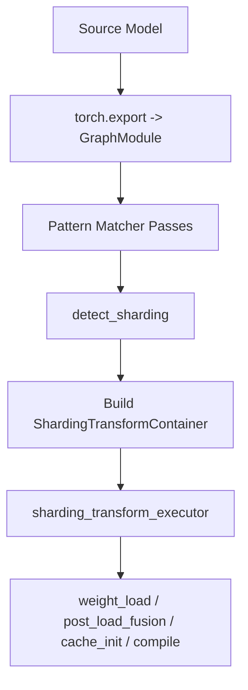
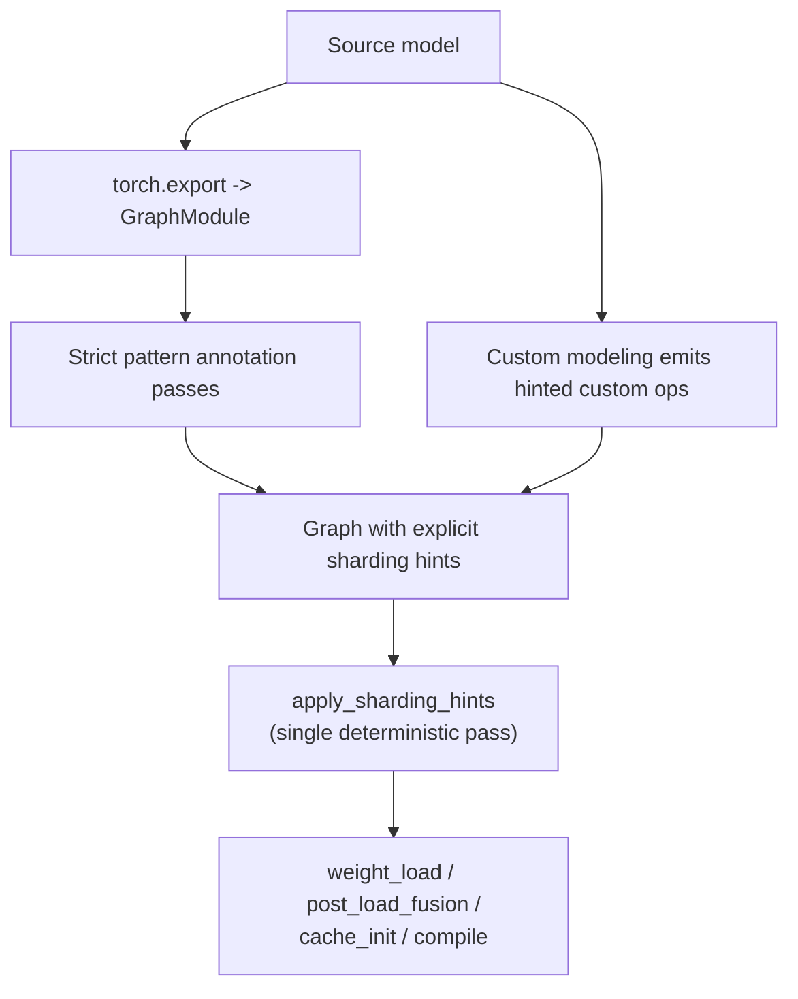

# AutoDeploy Sharding Redesign: Hint-Only, Pattern-Driven Architecture

## Document Status

- Status: Active implementation log
- Last updated: 2026-03-09
- Authors: GK + AD sharding team
- Audience: AutoDeploy maintainers, model onboarding owners, quantization maintainers, distributed runtime owners
- Scope: AutoDeploy graph sharding in `tensorrt_llm/_torch/auto_deploy/transform/library/sharding.py` and adjacent custom-op, pattern-matching, and modeling integration points
- Supersedes: [new_sharding_proposal_1.md](new_sharding_proposal_1.md) (layer-oriented redesign), [new_sharding_proposal_2.md](new_sharding_proposal_2.md), and [new_sharding_proposal_3.md](new_sharding_proposal_3.md) (hint-only redesign with collective ops)

---

## Changelog

| Date | Change | Rationale |
|------|--------|-----------|
| 2026-02-28 | Dropped `tp_mode="gather"` from TP hint enum. | `"gather"` bundled two operations (colwise shard + all_gather) into one hint, violating the node-local contract. Column-shard + all_gather is now two separate nodes. |
| 2026-02-28 | Added `torch_dist_collective` sharding-aware custom op with `op` and `group` parameters. | Collectives must be explicit, declarative nodes in the graph -- consistent with how all other sharding-aware ops work. `apply_sharding_hints` resolves them to real ops or identity based on `Mapping`. |
| 2026-02-28 | Removed `ep_apply_output_all_reduce` from MoE op signatures. | Collective placement is now the pattern's responsibility via explicit `torch_dist_collective` nodes, not a flag on the compute op. |
| 2026-02-28 | Updated all pattern examples (attention, MLP, MoE) to include explicit `torch_dist_collective` nodes. | Makes collective placement visible and explicit in every pattern. |
| 2026-02-28 | Promoted this document to active implementation log. | This document now tracks both design decisions and implementation progress. |
| 2026-03-09 | AD-SHARD-001 completed: TP hints added to `torch_linear_simple`. | Branch: `gk/ad-shard-001-tp-hints-linear-simple`. |
| 2026-03-09 | AD-SHARD-002 completed: TP hints added to all four fake quant linear ops. | Branch: `gk/ad-shard-002-tp-hints-fake-quant-linears`. Includes hint forwarding in INT4's internal `torch_linear_simple` call. |
| 2026-03-09 | Renamed `output_sizes` to `output_sizes` across all ops, tests, and this document. | Aligns with vLLM naming convention (`output_sizes` parameter in `MergedColumnParallelLinear`). More general and intuitive than the TensorRT-LLM-specific `output_sizes` name. |
| 2026-03-09 | Renamed BMM hint params: `dp_mode` -> `bmm_mode`, `dp_axis` -> `bmm_dim`. Updated ticket descriptions AD-SHARD-004/005. | "DP" was a historical misnomer -- BMM batch dimension represents experts (MoE), not data parallelism. `bmm_mode`/`bmm_dim` accurately describe the sharding intent. |
| 2026-03-09 | AD-SHARD-003 completed: TP hints added to real quant linears. | Branch: `gk/ad-shard-003-tp-hints-real-quant-linears`. |
| 2026-03-09 | Renamed shape helper ops: `torch_shardable_view` -> `view`, `torch_shardable_split` -> `split`. | Simpler names under the `auto_deploy` namespace (`torch.ops.auto_deploy.view`, `torch.ops.auto_deploy.split`). The `torch_shardable_` prefix was unnecessarily verbose. |

## Progress

| Ticket | Status | Branch |
|--------|--------|--------|
| AD-SHARD-001 | **Done** | `gk/ad-shard-001-tp-hints-linear-simple` |
| AD-SHARD-002 | **Done** | `gk/ad-shard-002-tp-hints-fake-quant-linears` |
| AD-SHARD-003 | **Done** | `gk/ad-shard-003-tp-hints-real-quant-linears` |
| AD-SHARD-004 | Next | -- |

---

## 1. Executive Summary

AutoDeploy's sharding pipeline has grown increasingly fragile as model diversity has expanded beyond the original MLP + MHA transformer pattern. The current architecture relies on topology-based heuristics that infer sharding intent from graph structure, producing false positives (incorrect sharding that breaks compilation) and false negatives (missed optimizations). The detect-then-execute two-pass design, the intermediate `ShardingInfo` metadata layer, and three independent config sources (`factory`, `manual`, `heuristic`) each add complexity that scales poorly.

This proposal replaces the entire sharding pipeline with a simpler, deterministic architecture built on three key decisions:

1. **Hint-only, node-local sharding.** Sharding intent is encoded directly on custom-op call arguments (`tp_mode`, `ep_mode`, `bmm_mode`). A single deterministic transform (`apply_sharding_hints`) reads these hints and applies sharding using the runtime `Mapping` object. There is no cross-node propagation and no topology inference. This extends to collectives: a dedicated `torch_dist_collective` op declaratively marks where collectives belong in the graph, and `apply_sharding_hints` resolves each to a real distributed op or an identity no-op based on `Mapping`.

2. **Strict, per-layer-variant pattern matching with no fallback.** For HuggingFace models, sharding hints are placed by dedicated pattern-matching passes -- one pattern per known layer variant (e.g., GQA attention with fused QKV, SwiGLU MLP, MoE with shared experts). If no pattern matches a layer, that layer stays unsharded. There is no "generic" fallback, no logging of unmatched layers, and no best-effort simple-shard. False negatives are acceptable; false positives are not.

3. **Drop `base_model_tp_plan` and YAML manual config.** The HuggingFace `base_model_tp_plan` (factory config) is node-oriented and cannot express the auxiliary graph rewrites (view, reshape, split updates) that sharding requires. It is replaced entirely by the pattern matcher. The YAML `manual_config` field is dropped; manual sharding is done by modifying model source code to emit hinted custom ops directly (the "custom modeling path").

4. **Explicit collective placement.** A dedicated `torch_dist_collective` op declaratively marks where collectives belong in the graph. `apply_sharding_hints` resolves each to a real `dist.all_reduce` / `dist.all_gather` or an identity no-op based on `Mapping`. Patterns place these nodes explicitly; no automatic collective insertion.

The resulting pipeline is: **export -> pattern annotation -> apply_sharding_hints -> weight_load**.

---

## 2. Background: Current Architecture (As-Is)

### 2.1 Current Pipeline

The default AutoDeploy config runs a two-step sharding pipeline (from `config/default.yaml`):

```yaml
detect_sharding:
  stage: sharding
  simple_shard_only: false
  sharding_source: ['manual', 'factory', 'heuristic']
  support_partial_config: true
  sharding_dims: ['tp', 'ep', 'bmm']
  shard_all_unprocessed: false
  allreduce_strategy: 'NCCL'
  dist_backend: auto
  requires_shape_prop: true
sharding_transform_executor:
  stage: sharding
  run_shape_prop: true
```

This produces the following execution flow:



### 2.2 Three Config Sources

Detection iterates through three sources in order:

1. **Manual** -- user-provided `tp_plan` dict in YAML (e.g., `{"layers.*.mlp.gate_proj": "colwise"}`).
2. **Factory** -- auto-populated from `model_config.base_model_tp_plan` in `HuggingFaceModelFactory._set_sharding_config()`.
3. **Heuristic** -- topology-based detection: `detect_column_row_shard` (TP), `detect_ep_shard` (EP), `detect_dp_bmm_shard` (BMM).

All three sources produce `ShardingInfo` objects collected into a `ShardingTransformContainer`, which is consumed by `sharding_transform_executor`.

### 2.3 Intermediate Representation

Detection does not directly mutate the graph. It records transform intents via a class hierarchy:

- `WeightShardingInfo`, `FP8WeightShardingInfo`, `FP4WeightShardingInfo`
- `BMMShardingInfo`
- `EPShardingInfo`, `FP8EPShardingInfo`, `NVFP4EPShardingInfo`, `MXFP4EPShardingInfo`
- `RMSNormShardingInfo`, `ParameterUpdateInfo`

The executor then applies them in bucketed order (TP first, then BMM, then EP, etc.), introducing ordering complexity and indirection.

### 2.4 Pain Points

**False-positive risk.** Heuristic detection can over-apply sharding to incompatible graph regions. For example, MLA internal latent projections (`q_a_proj` -> `q_b_proj`) form a shape-compatible pair that the topology heuristic misidentifies as a small MLP layer.

**MoE with shared experts cannot be sharded as a unit.** In models like Qwen3/DeepSeek-V3, a MoE layer has two parallel paths (routed experts + shared experts) that merge before the residual. The current architecture handles them independently: `_insert_sharded_moe` adds an `all_reduce` for the routed path, and `_process_column_row_shard` adds another for the shared path. There is no mechanism to fuse them into a single `all_reduce` at the merge point:

```
                    hidden_states
                    /            \
          routed_experts    shared_experts
          (EP shard)        (TP shard)
                    \            /
                     add / merge
                         |
              all_reduce + all_reduce   <-- WRONG: two independent all_reduces
                         |
                     residual add
```

**Proliferation of specialized handlers.** Every new layer type (SSM, MLA, GatedDeltaNet) required a dedicated `_process_*_sharding` function that reimplements similar logic (find weights, update splits/views, shard out_proj). The "general" col-row path serves fewer and fewer real models.

**Config cannot express layer-level intent.** HuggingFace `base_tp_plan` maps weight names to sharding modes (`"q_proj": "colwise"`), but this cannot express auxiliary graph operations (updating view/reshape shapes, split sizes, conv1d channel counts). The heuristic pipeline performs these "cleanup" passes implicitly, making the config not self-contained.

**Debugging is slower.** Intent is spread across detection logic, container state, and executor ordering. Users must reason about *why* a region was inferred, not just *what* was requested.

---

## 3. Design Goals and Non-Goals

### Goals

1. **Deterministic sharding execution** for the same `(graph, mapping)` input.
2. **Node-local semantics only:** no cross-node propagation and no implicit shape updates.
3. **Hint-driven contract:** sharding intent must be explicit on custom-op arguments.
4. **Conservative pattern matching:** strict per-layer-variant patterns, tolerate false negatives, avoid false positives.
5. **Simpler internal architecture:** deprecate `ShardingInfo` + container + separate executor stage.
6. **Quantization parity:** preserve FP8/NVFP4 scale handling and load-hook behavior.
7. **Incremental migration path:** introduce with compatibility and staged rollout.

### Non-goals

- Building a universal heuristic detector for unknown graphs.
- Implicitly "fixing" neighboring shape ops after sharding.
- Introducing group-id contracts (`tp_group_id`, `ep_group_id`, etc.).
- Supporting HuggingFace `base_model_tp_plan` as a sharding source.
- Providing a YAML-based manual sharding config.
- Logging or warning about "unmatched" layers (there is no ground truth for how many layers *should* match).

---

## 4. Proposed Architecture (To-Be)

### 4.1 Core Idea

The graph itself becomes the source of truth for sharding intent. Custom ops that are shard-relevant include explicit, local sharding hints in their signatures. A single deterministic transform (`apply_sharding_hints`) iterates nodes and applies sharding directly from node arguments using the runtime `Mapping` object.

There is no "detect then execute" split. There is no inferred propagation. There is no intermediate metadata layer.

### 4.2 Architecture Diagram



Two paths place hints onto graph nodes:

1. **Pattern annotation passes** (for HuggingFace models): FX pattern matchers replace vanilla op subgraphs with hinted custom-op subgraphs. Each pattern covers an entire layer variant (attention, MLP, MoE, etc.) and explicitly rewrites all nodes that need sharding-aware behavior.

2. **Custom modeling path** (for manually authored models): model authors emit `torch.ops.auto_deploy.*` ops with explicit hint arguments directly in their model code.

Both paths converge on the same graph representation, which `apply_sharding_hints` processes uniformly.

### 4.3 Determinism Contract

Given:
- identical FX graph structure
- identical sharding-hint arguments on nodes
- identical runtime `Mapping`

Then:
- sharding transform emits identical graph rewrites
- parameter slicing and load-hook registration are deterministic
- no extra graph rewrites happen from topology inference

### 4.4 Runtime Mapping Contract

`apply_sharding_hints` reads sharding dimensions from the runtime `Mapping` object (in `SharedConfig`), including:

- global rank and world size
- tensor parallel rank and size (`tp_rank`, `tp_size`)
- expert parallel rank and size (`moe_ep_rank`, `moe_ep_size`)
- data-parallel dimensions when relevant

No topology identifiers (`ep_size`, `ep_rank`, `tp_group_id`, etc.) are encoded in graph hints. The graph expresses *what* to shard; `Mapping` provides the *how*.

### 4.5 Running Example: MoE with Shared Experts (Fixed)

In the new architecture, a pattern pass for MoE+shared_experts rewrites the entire residual block:

```
                    hidden_states
                    /            \
          torch_moe              torch_linear_simple (gate)
          (ep_mode="expert")     (tp_mode="colwise")
                  |              torch_linear_simple (up)
                  |              (tp_mode="colwise")
                  |                    |
                  |              silu + mul
                  |                    |
                  |              torch_linear_simple (down)
                  |              (tp_mode="rowwise",
                  |               NO all_reduce inserted here)
                    \            /
                     add / merge
                         |
              torch_dist_collective   <-- explicit collective, placed by pattern
              (op="all_reduce", group="tp")
                         |
                     residual add
```

The pattern owns the entire subgraph and places exactly one `all_reduce` at the merge point. The `apply_sharding_hints` transform does not add any additional collectives -- it only processes the hinted linear/MoE nodes for weight slicing and load hooks.

---

## 5. Hint Schema

Sharding hints are minimal, node-local keyword arguments added to custom-op signatures. They use string enums with defaults that preserve backward compatibility (`"none"` = no sharding action).

### 5.1 Tensor Parallel (TP) Hints

| Hint | Type | Default | Description |
|------|------|---------|-------------|
| `tp_mode` | `str` | `"none"` | `"none"`, `"colwise"`, `"rowwise"` |
| `output_sizes` | `Optional[List[int]]` | `None` | Sizes for fused-weight partitioning (e.g., fused QKV) |
| `tp_min_local_shape` | `int` | `1` | Guard: skip sharding if local shard < this size |

**Running example** -- fused QKV projection with `tp_mode="colwise"`:

```python
qkv = torch.ops.auto_deploy.torch_linear_simple(
    x,
    w_qkv,
    b_qkv,
    tp_mode="colwise",
    output_sizes=[q_dim, kv_dim, kv_dim],
    tp_min_local_shape=head_dim,
)
```

`apply_sharding_hints` sees `tp_mode="colwise"` on this node, reads `tp_size` and `tp_rank` from `Mapping`, and slices `w_qkv` along dimension 0 with fused-group-aware partitioning. No neighboring nodes are touched.

### 5.2 Expert Parallel (EP) Hints

| Hint | Type | Default | Description |
|------|------|---------|-------------|
| `ep_mode` | `str` | `"none"` | `"none"`, `"expert"` |
| `ep_remainder_policy` | `str` | `"last_rank"` | `"last_rank"`, `"strict_even"` |

### 5.3 BMM Hints

| Hint | Type | Default | Description |
|------|------|---------|-------------|
| `bmm_mode` | `str` | `"none"` | `"none"`, `"batch_split"` |
| `bmm_dim` | `int` | `0` | Batch dimension to split along |

### 5.4 Shape Helper Op Hints

For `view` and `split`:

| Hint | Type | Default | Description |
|------|------|---------|-------------|
| `tp_mode` | `str` | `"none"` | Must match the upstream linear's `tp_mode` |
| `tp_scaled_dim` | `int` | `-1` | Which dimension in the view shape to scale by `1/tp_size` |
| `tp_scale_split_sizes` | `bool` | `False` | Whether to divide split sizes by `tp_size` |

### 5.5 Collective Operation Hints

A single sharding-aware collective op replaces all implicit collective insertion:

```python
def torch_dist_collective(
    x: torch.Tensor,
    op: str,            # "all_reduce", "all_gather"
    group: str,         # "tp", "ep", "dp", "pp"
    dim: int = 0,       # tensor axis for all_gather concat (ignored for all_reduce)
) -> torch.Tensor
```

`apply_sharding_hints` resolves each node based on `Mapping`:

| `op` | `group` | Mapping check | Resolves to |
|------|---------|---------------|-------------|
| `"all_reduce"` | `"tp"` | `tp_size > 1` | `dist.all_reduce()` or identity |
| `"all_reduce"` | `"ep"` | `ep_size > 1` | `dist.all_reduce()` or identity |
| `"all_gather"` | `"tp"` | `tp_size > 1` | `dist.all_gather()` or identity |

When unsharded (`world_size == 1`), the op is an identity pass-through.

### 5.6 Explicit Exclusions

This design intentionally excludes:

- **Group IDs** (`tp_group_id`, `ep_group_id`, `bmm_group_id`) -- topology is in `Mapping`, not in the graph.
- **Propagation flags** (`tp_adjust_following_shape_ops` or similar) -- if a shape op needs adaptation, it must be an explicit shardable helper op with its own hints.

---

## 6. Config Sources: What Changes

This is the most significant policy change relative to the current architecture. All three existing config sources are replaced.

### 6.1 Summary Table

| Current Source | Current Mechanism | New Equivalent | Rationale |
|---|---|---|---|
| **Factory** (`base_model_tp_plan`) | HF model config auto-populates `tp_plan` dict | **Dropped.** Pattern matcher covers same models with better safety. | `tp_plan` is node-oriented (`"q_proj": "colwise"`) and cannot express auxiliary graph rewrites (view/reshape/split). The pattern matcher rewrites the full layer subgraph, making implicit cleanup unnecessary. |
| **Manual** (YAML `tp_plan`) | User writes `tp_plan` in `default.yaml` or override config | **Dropped as YAML field.** Replaced by the **custom modeling path**: modify model source code to emit hinted custom ops. | YAML `tp_plan` has the same expressiveness limitation as factory config. The custom modeling path is higher-confidence and self-contained. |
| **Heuristic** (`detect_column_row_shard`, etc.) | Topology-based inference over graph structure | **Dropped.** Replaced by **strict pattern annotation passes**: one pattern per known layer variant. | Heuristics produce false positives. Patterns are conservative and explicit. |

### 6.2 Why Drop `base_model_tp_plan`?

HuggingFace models increasingly provide a `base_model_tp_plan` attribute, mapping weight names to sharding modes:

```python
# Example from a HuggingFace model config
base_model_tp_plan = {
    "layers.*.self_attn.q_proj": "colwise",
    "layers.*.self_attn.k_proj": "colwise",
    "layers.*.self_attn.v_proj": "colwise",
    "layers.*.self_attn.o_proj": "rowwise",
    "layers.*.mlp.gate_proj": "colwise",
    "layers.*.mlp.up_proj": "colwise",
    "layers.*.mlp.down_proj": "rowwise",
}
```

This tells us *which weights to shard* and *in which direction*, but it does not tell us:

- How to update the `view` that reshapes QKV output into `[B, S, num_heads, head_dim]` (the `num_heads` dimension must be divided by `tp_size`).
- How to update the `split_with_sizes` that separates fused QKV into Q, K, V (the split sizes must be scaled).
- Where to insert the `all_reduce` (after `o_proj`? after the residual add?).
- How to handle fused QKV weights (one weight matrix producing Q, K, V with different group sizes).

In the current pipeline, `detect_sharding_from_config` applies the `tp_plan`, and then `detect_column_row_shard` performs implicit "cleanup" passes to fix up view/reshape/split nodes. This makes the config not self-contained -- it depends on heuristic post-processing that can itself be wrong.

In the new design, the pattern matcher replaces the entire layer subgraph (from `aten.linear` to `auto_deploy.torch_linear_simple` with hints, plus all intermediate view/split/reshape ops replaced with `view` / `split`). No cleanup is needed because the replacement is explicit and complete.

### 6.3 Why Drop YAML Manual Config?

The YAML `manual_config` has the same expressiveness limitation as `base_model_tp_plan`: it maps weight names to sharding modes but cannot express auxiliary graph updates.

The replacement is the **custom modeling path**: model authors write their model using `torch.ops.auto_deploy.*` custom ops with explicit sharding hints. This is the highest-confidence path because:

- Every shardable op has explicit hint arguments.
- Every shape op that needs adaptation uses `view` / `split`.
- No implicit cleanup or heuristic post-processing is needed.
- The model is self-documenting: reading the source code shows exactly what will be sharded and how.

### 6.4 What About Models Without Patterns?

If the pattern matcher does not recognize a layer variant in a HuggingFace model, that layer stays unsharded. This is by design:

- There is no ground truth for how many layers "should" match. A model may have layers that are intentionally unshardable.
- Logging "unmatched layers" would produce noise without actionable information.
- The correct response to an unmatched layer is to author a new pattern or use the custom modeling path.

This is a tradeoff: we accept false negatives (under-sharding) to eliminate false positives (incorrect sharding). For a compiler frontend, this is the right tradeoff because a false positive can fail the entire deployment pipeline.

---

## 7. Pattern Matching: Strict, Per-Layer, No Fallback

### 7.1 Philosophy

Each architectural layer variant gets a dedicated pattern that matches its exact graph topology and replaces it with hinted custom ops. There is no "generic attention" pattern -- there are specific patterns for:

- GQA attention with fused QKV + RoPE
- GQA attention with separate Q/K/V projections + RoPE
- MLA attention with latent projections
- SwiGLU MLP
- GeLU MLP
- MoE with routed experts only
- MoE with routed + shared experts
- Mamba2 / SSM
- GatedDeltaNet

Each pattern:
- **Matches conservatively.** An `extra_check` function validates weight shapes, head counts, and dimensional consistency before accepting a match.
- **Replaces completely.** The replacement subgraph includes all nodes that need sharding-aware behavior: linear ops become `torch_linear_simple` with hints, view/reshape/split ops become `view` / `split` with hints, and collectives (`all_reduce`) are placed at the correct merge point.
- **Is self-contained.** No downstream "fix-up" pass is expected or performed.

### 7.2 Running Example: GQA Attention Pattern

Source pattern (what the pattern matcher looks for in the exported graph):

```python
def _attn_qkv_rope_attn_out_source(
    x, w_qkv, b_qkv, w_out, b_out, cos, sin, attn_mask,
    num_q_heads, num_kv_heads, head_dim, is_causal=True,
):
    qkv = torch.ops.aten.linear.default(x, w_qkv, b_qkv)
    q_dim = num_q_heads * head_dim
    kv_dim = num_kv_heads * head_dim
    q, k, v = torch.ops.aten.split_with_sizes.default(
        qkv, [q_dim, kv_dim, kv_dim], dim=-1
    )
    bsz, seq = x.shape[0], x.shape[1]
    q = torch.ops.aten.view.default(q, [bsz, seq, num_q_heads, head_dim])
    k = torch.ops.aten.view.default(k, [bsz, seq, num_kv_heads, head_dim])
    v = torch.ops.aten.view.default(v, [bsz, seq, num_kv_heads, head_dim])
    q_r, k_r = torch.ops.auto_deploy.torch_rope_with_explicit_cos_sin.default(
        q, k, cos, sin, 2
    )
    attn = torch.ops.auto_deploy.torch_attention.default(
        q_r, k_r, v, attn_mask, 0.0, is_causal, None, None, None, None, "bsnd"
    )
    attn_2d = torch.ops.aten.reshape.default(attn, [bsz, seq, q_dim])
    out = torch.ops.aten.linear.default(attn_2d, w_out, b_out)
    return out
```

Replacement pattern (what replaces it, with sharding hints):

```python
def _attn_qkv_rope_attn_out_repl(
    x, w_qkv, b_qkv, w_out, b_out, cos, sin, attn_mask,
    num_q_heads, num_kv_heads, head_dim, is_causal=True,
):
    q_dim = num_q_heads * head_dim
    kv_dim = num_kv_heads * head_dim
    bsz, seq = x.shape[0], x.shape[1]

    qkv = torch.ops.auto_deploy.torch_linear_simple(
        x, w_qkv, b_qkv,
        tp_mode="colwise",
        output_sizes=[q_dim, kv_dim, kv_dim],
        tp_min_local_shape=head_dim,
    )
    q, k, v = torch.ops.auto_deploy.split(
        qkv, [q_dim, kv_dim, kv_dim], dim=-1,
        tp_mode="colwise", tp_scale_split_sizes=True,
    )
    q = torch.ops.auto_deploy.view(
        q, [bsz, seq, num_q_heads, head_dim],
        tp_mode="colwise", tp_scaled_dim=2,
    )
    k = torch.ops.auto_deploy.view(
        k, [bsz, seq, num_kv_heads, head_dim],
        tp_mode="colwise", tp_scaled_dim=2,
    )
    v = torch.ops.auto_deploy.view(
        v, [bsz, seq, num_kv_heads, head_dim],
        tp_mode="colwise", tp_scaled_dim=2,
    )
    q_r, k_r = torch.ops.auto_deploy.torch_rope_with_explicit_cos_sin.default(
        q, k, cos, sin, 2
    )
    attn = torch.ops.auto_deploy.torch_attention.default(
        q_r, k_r, v, attn_mask, 0.0, is_causal, None, None, None, None, "bsnd"
    )
    attn_2d = torch.ops.auto_deploy.view(
        attn, [bsz, seq, q_dim],
        tp_mode="colwise", tp_scaled_dim=-1,
    )
    out = torch.ops.auto_deploy.torch_linear_simple(
        attn_2d, w_out, b_out,
        tp_mode="rowwise", tp_min_local_shape=head_dim,
    )
    out = torch.ops.auto_deploy.torch_dist_collective(
        out, op="all_reduce", group="tp",
    )
    return out
```

Every node that changes behavior under sharding is explicitly rewritten. The `apply_sharding_hints` transform will later read the hints and apply weight slicing/load hooks, but it will not touch any neighboring nodes.

### 7.3 Running Example: SwiGLU MLP Pattern

```python
def _mlp_swiglu_source(x, w_gate, b_gate, w_up, b_up, w_down, b_down):
    gate = torch.ops.aten.linear.default(x, w_gate, b_gate)
    up = torch.ops.aten.linear.default(x, w_up, b_up)
    act = torch.ops.aten.silu.default(gate)
    fused = torch.ops.aten.mul.Tensor(act, up)
    out = torch.ops.aten.linear.default(fused, w_down, b_down)
    return out

def _mlp_swiglu_repl(x, w_gate, b_gate, w_up, b_up, w_down, b_down):
    gate = torch.ops.auto_deploy.torch_linear_simple(
        x, w_gate, b_gate, tp_mode="colwise", tp_min_local_shape=1,
    )
    up = torch.ops.auto_deploy.torch_linear_simple(
        x, w_up, b_up, tp_mode="colwise", tp_min_local_shape=1,
    )
    act = torch.ops.aten.silu.default(gate)
    fused = torch.ops.aten.mul.Tensor(act, up)
    out = torch.ops.auto_deploy.torch_linear_simple(
        fused, w_down, b_down, tp_mode="rowwise", tp_min_local_shape=1,
    )
    out = torch.ops.auto_deploy.torch_dist_collective(
        out, op="all_reduce", group="tp",
    )
    return out
```

The SwiGLU MLP has no view/split/reshape ops, so the replacement only touches linear nodes. The `silu` and `mul` ops are element-wise and do not need sharding-aware behavior.

### 7.4 Pattern Safety: `extra_check`

Every pattern is wrapped in a transform class that registers it with conservative `extra_check` safeguards:

```python
def _extra_check(match: Match) -> bool:
    if num_q_heads % tp_size != 0:
        return False
    if num_kv_heads % tp_size != 0:
        return False
    w_qkv = match.kwargs.get("w_qkv")
    w_out = match.kwargs.get("w_out")
    if w_qkv is None or w_out is None:
        return False
    qkv_out_features = int(w_qkv.meta["val"].shape[0])
    expected = (num_q_heads + 2 * num_kv_heads) * head_dim
    if qkv_out_features != expected:
        return False
    return True
```

If the check fails, the match is rejected. No replacement occurs. No fallback is triggered. The layer stays unsharded.

### 7.5 MoE with Shared Experts: Pattern Scope

The MoE+shared_experts pattern is the most complex case. It must match the entire residual block containing both the routed MoE path and the shared-expert MLP path, and place a single `all_reduce` at the merge point.

There are two implementation strategies:

**Option A: Single large pattern.** One pattern covers the full subgraph from `hidden_states` to `residual_add`, including both branches. This is the most correct approach but produces a large pattern that may be fragile to minor graph variations.

**Option B: Two-step approach.** A first pass annotates the routed MoE node with `ep_mode="expert"` and the shared-expert MLP with `tp_mode="colwise"` / `tp_mode="rowwise"`. A second pass identifies the merge point between the two annotated branches and places a single `all_reduce`. This is more modular but requires cross-pattern coordination.

Both options are valid. The implementation should start with Option A for correctness, then evaluate Option B if pattern fragility becomes an issue.

---

## 8. Custom Modeling Path

For models that are manually authored (in `models/custom/`), pattern matching is bypassed entirely. Model authors emit hinted custom ops directly in their `forward()` method:

```python
# Custom model forward -- no pattern matching needed
hidden = torch.ops.auto_deploy.torch_linear_simple(
    hidden,
    self.qkv_weight,
    self.qkv_bias,
    tp_mode="colwise",
    output_sizes=[self.q_dim, self.k_dim, self.v_dim],
    tp_min_local_shape=self.head_dim,
)
q, k, v = torch.ops.auto_deploy.split(
    hidden,
    [self.q_dim, self.k_dim, self.v_dim],
    dim=-1,
    tp_mode="colwise",
    tp_scale_split_sizes=True,
)
```

This is the highest-confidence path:
- Every shardable op has explicit hints.
- Every shape op uses explicit helper ops.
- No downstream heuristic "fix-up" is expected.
- The model code is self-documenting.

This replaces the current YAML `manual_config`. Instead of writing:

```yaml
# OLD: YAML manual config (DROPPED)
detect_sharding:
  manual_config:
    tp_plan:
      "layers.*.self_attn.q_proj": "colwise"
      "layers.*.self_attn.o_proj": "rowwise"
```

Authors modify the model source code directly. This is a higher bar for entry but produces a more robust result.

---

## 9. Quantization Integration

### 9.1 Hard Contract: Hint Forwarding

Quantized custom ops carry the same TP/EP/DP hints as their non-quantized equivalents. When quantization passes (`quantization.py`, `fuse_quant.py`) rewrite ops, they **must** preserve sharding hint arguments:

```
torch_linear_simple(x, w, b, tp_mode="colwise")
          |
          | quantize_fp8 pass rewrites this to:
          v
torch_quant_fp8_linear(x, w_fp8, b, input_scale, weight_scale, tp_mode="colwise")
```

This is a hard requirement for determinism. If a quantization pass drops hints, `apply_sharding_hints` will see `tp_mode="none"` and skip the node, producing incorrect results.

### 9.2 Behaviors to Preserve

The following quantization-aware behaviors from the current `QuantizationShardingMixin` must remain functionally equivalent:

- **FP8 linear:** Scale tensor registration/sharding, deterministic load hooks for sliced `input_scale` and `weight_scale`.
- **NVFP4 linear:** Special handling for packed weights and per-block scales, load-hook behavior for sharded scales.
- **MoE FP8/NVFP4:** Expert-local scale sharding, routed output behavior based on EP hints.

`apply_sharding_hints` dispatches to quant-aware handlers by op type. The handler for `torch_quant_fp8_linear` knows how to shard the FP8 weight and its associated scales; the handler for `torch_linear_simple` handles only dense weights.

---

## 10. The `apply_sharding_hints` Transform

### 10.1 Responsibilities

`apply_sharding_hints` is the **only** sharding transform in the default path. It:

1. Reads runtime `Mapping` from `SharedConfig`.
2. Iterates graph nodes once.
3. Checks whether a node has explicit sharding hints (any hint != `"none"`).
4. Applies deterministic, node-local rewrite/load-hook updates.
5. Does **not** infer or propagate to neighbors.

### 10.2 Pseudocode

```python
@TransformRegistry.register("apply_sharding_hints")
class ApplyShardingHints(BaseTransform):
    def _apply(self, gm, cm, factory, shared_config):
        mapping = shared_config.mapping
        if mapping is None or mapping.world_size < 2:
            return gm, TransformInfo(
                skipped=True, num_matches=0,
                is_clean=True, has_valid_shapes=True,
            )

        num_updates = 0
        for node in list(gm.graph.nodes):
            if not is_shardable_custom_op(node):
                continue

            hints = parse_hints(node)
            if hints.tp_mode != "none":
                num_updates += apply_tp_node_local(gm, node, hints, mapping)
            if hints.ep_mode != "none":
                num_updates += apply_ep_node_local(gm, node, hints, mapping)
            if hints.bmm_mode != "none":
                num_updates += apply_bmm_node_local(gm, node, hints, mapping)
            if is_collective_op(node):
                num_updates += resolve_collective(gm, node, mapping)

        gm.graph.lint()
        gm.recompile()
        return gm, TransformInfo(
            skipped=False, num_matches=num_updates,
            is_clean=(num_updates == 0),
            has_valid_shapes=(num_updates == 0),
        )
```

### 10.3 Node-Local Handler Behavior

**TP handler:**
- Applies row/column split based only on node args and `mapping.tp_rank` / `mapping.tp_size`.
- Supports fused-weight partitioning using explicit `output_sizes`.
- Enforces `tp_min_local_shape` guard (skip + warning if violated).
- Registers deterministic load hooks for parameter shards.
- Does **not** rewrite neighboring `view`/`split` unless those neighbors are explicit shardable helper ops with their own hints.

**EP handler:**
- Applies expert partitioning over expert-dimensioned tensors.
- Uses `ep_remainder_policy`: `strict_even` rejects uneven splits; `last_rank` places remainder on last EP rank.
- Runtime `Mapping` provides `ep_size`/`ep_rank` (replacing the legacy `triton_mxfp4_moe_ep` pattern of encoding topology in the op signature).

**BMM handler:**
- Applies batch slicing along `bmm_dim` for explicitly marked BMM ops.
- Inserts gather/reduction according to `bmm_mode`.

**Collective handler:**
- Resolves `torch_dist_collective` nodes to real `dist.all_reduce` / `dist.all_gather` or identity based on `group` and `Mapping`.
- `group="tp"` + `tp_size == 1` -> identity. `group="ep"` + `ep_size == 1` -> identity. Etc.

### 10.4 Failure Policy

- Unsupported hints -> warning + skip node (no fallback heuristics).
- Invalid sharding dimensions -> warning + skip node.
- Missing required quant tensors for selected mode -> error when correctness would be violated.
- No hidden neighbor rewrites.

---

## 11. Config and Interface Changes

### 11.1 New `default.yaml` Shape

Replace the current sharding stages:

```yaml
# CURRENT (remove)
detect_sharding:
  stage: sharding
  ...
sharding_transform_executor:
  stage: sharding
  ...
```

With pattern annotation passes and the hint applier:

```yaml
# NEW
annotate_sharding_hints:
  stage: sharding
  requires_shape_prop: true
apply_sharding_hints:
  stage: sharding
  run_shape_prop: false
```

### 11.2 SharedConfig Extended with Mapping

In `transform/interface.py`:

```python
class SharedConfig(BaseModel):
    local_rank: int = 0
    world_size: int = 1
    mapping: Optional[Mapping] = None  # NEW: full runtime topology
```

### 11.3 Executor Wiring

In `shim/ad_executor.py` and `transform/optimizer.py`, inject `Mapping` into optimizer shared config before transforms execute. This removes ad-hoc topology reconstruction from sharding internals.

---

## 12. Migration Strategy

### 12.1 Phases

**Phase 0: Design Sign-off (Week 0)**
- Align on hint schema and op signatures.
- Align on deprecation strategy for legacy framework.
- Finalize pilot model and initial pattern scope.

**Phase 1: API Groundwork (Weeks 1--2)**
- Add TP/EP/DP hint kwargs to all shardable custom ops (with `"none"` defaults for backward compatibility).
- Add `view` and `split` helper ops.
- Extend `SharedConfig` with `Mapping` and wire it through the optimizer.

**Phase 2: Core Sharder Implementation (Weeks 3--4)**
- Implement `apply_sharding_hints` transform with TP, EP, and DP handlers.
- Port quantization-aware scale/load-hook handling into new handlers.
- Enable behind feature flag.

**Phase 3: Integration Pilots (Weeks 5--6)**
- Migrate one custom model to use explicit sharding hints (pilot validation).
- Implement attention and MLP pattern annotation passes.
- Validate multi-GPU correctness.

**Phase 4: Default-Path Transition (Weeks 7--8)**
- Switch default config to new sharder.
- Mark legacy transforms as deprecated.
- Keep temporary fallback behind non-default flag if needed for one release window.

**Phase 5: Cleanup (Week 9+)**
- Remove fallback paths.
- Remove `ShardingInfo` container machinery.
- Remove heuristic TP detection code.
- Finalize documentation.

### 12.2 Backward Compatibility

- New kwargs with `"none"` defaults mean existing callsites continue to work unchanged.
- Legacy heuristic sharding can be temporarily retained behind a non-default config flag during the rollout window.
- The transition is opt-in per-model until Phase 4.

### 12.3 Deprecation Targets

The following will be deprecated and removed:

- `ShardingInfo` class hierarchy (`WeightShardingInfo`, `FP8WeightShardingInfo`, etc.)
- `ShardingTransformContainer`
- `sharding_transform_executor` transform
- `detect_sharding` transform (including `detect_column_row_shard`, `detect_ep_shard`, `detect_dp_bmm_shard`)
- `ShardingTransformConfig` fields: `factory_config`, `manual_config`, `sharding_source`, `sharding_dims`, `shard_all_unprocessed`, `simple_shard_only`
- Heuristic layer classification: `get_all_layer_subgraphs`, `get_layer_after_linear_node`
- Specialized handlers: `_process_ssm_sharding`, `_process_mla_sharding`, `_process_delta_sharding`

---

## 13. Risks and Mitigations

**Risk: Missed hint coverage causes under-sharding (false negatives).**
Mitigation: Acceptable by design. Add targeted patterns as new layer variants are encountered. The custom modeling path is always available as a fallback for unsupported architectures.

**Risk: Migration complexity for quantized paths.**
Mitigation: Dedicated quantization parity validation in the execution plan. Load-hook regression tests ensure functional equivalence.

**Risk: Temporary dual-path maintenance overhead.**
Mitigation: Short deprecation window (one release) with explicit exit criteria. Legacy path behind non-default flag, not in the default pipeline.

**Risk: Model authors forget to hint dependent shape ops.**
Mitigation: Provide `view` and `split` helper ops with clear documentation. `apply_sharding_hints` does not silently fix up unhinted shape ops -- the resulting shape mismatch will produce an explicit error at compile time.

**Risk: Large patterns (MoE+shared_experts) may be fragile to minor graph variations.**
Mitigation: Start with the single-pattern approach (Option A in Section 7.5) and evaluate the two-step approach (Option B) if fragility becomes an issue. The `extra_check` safeguard rejects uncertain matches.

**Risk: Quantization passes may drop sharding hints during op rewrites.**
Mitigation: Document the hint-forwarding contract explicitly (Section 9.1). Add CI tests that verify hints are preserved through quantization transforms.

---

## 14. Open Questions

1. Should `view` / `split` be introduced in Phase 1 (immediately) or deferred until patterns need them in Phase 3?
2. Should unsupported hint modes be hard errors in strict mode, or warnings + skip by default?
3. Which pilot model should be the first custom-model migration target?
4. For MoE+shared_experts, should we start with the single-pattern approach (Option A) or the two-step approach (Option B)?

### Resolved

1. **Who inserts `all_reduce`?** Resolved: explicit `torch_dist_collective` nodes placed by patterns. `apply_sharding_hints` resolves them. (2026-02-28)
2. **What does `tp_mode="gather"` mean?** Resolved: dropped. Column-shard + all_gather is two separate nodes. (2026-02-28)

---

## Appendix A: Complete Custom-Op Signature Catalog

This appendix enumerates all shard-relevant custom ops and their proposed signatures with explicit sharding hints.

### A.1 Linear and Quantized Linear Ops

**1) `auto_deploy::torch_linear_simple`**

```python
def torch_linear_simple(
    input: torch.Tensor,
    weight: torch.Tensor,
    bias: Optional[torch.Tensor],
    tp_mode: str = "none",
    output_sizes: Optional[List[int]] = None,
    tp_min_local_shape: int = 1,
) -> torch.Tensor
```

**2) `auto_deploy::torch_fake_quant_fp8_linear`**

```python
def torch_fake_quant_fp8_linear(
    input: torch.Tensor,
    weight_quantized: torch.Tensor,
    bias: Optional[torch.Tensor],
    input_scale: List[torch.Tensor],
    weight_scale: List[torch.Tensor],
    input_zp: List[torch.Tensor],
    weight_zp: List[torch.Tensor],
    tp_mode: str = "none",
    output_sizes: Optional[List[int]] = None,
    tp_min_local_shape: int = 1,
) -> torch.Tensor
```

**3) `auto_deploy::torch_fake_quant_nvfp4_linear`**

```python
def torch_fake_quant_nvfp4_linear(
    input: torch.Tensor,
    weight_quantized: torch.Tensor,
    bias: Optional[torch.Tensor],
    input_scale: List[torch.Tensor],
    weight_scale: List[torch.Tensor],
    input_zp: List[torch.Tensor],
    weight_zp: List[torch.Tensor],
    tp_mode: str = "none",
    output_sizes: Optional[List[int]] = None,
    tp_min_local_shape: int = 1,
) -> torch.Tensor
```

**4) `auto_deploy::torch_fake_quant_int4_linear`**

```python
def torch_fake_quant_int4_linear(
    input: torch.Tensor,
    weight_quantized: torch.Tensor,
    bias: Optional[torch.Tensor],
    input_scale: List[torch.Tensor],
    weight_scale: List[torch.Tensor],
    input_zp: List[torch.Tensor],
    weight_zp: List[torch.Tensor],
    tp_mode: str = "none",
    output_sizes: Optional[List[int]] = None,
    tp_min_local_shape: int = 1,
) -> torch.Tensor
```

**5) `auto_deploy::torch_fake_quant_int4_gptq_linear`**

```python
def torch_fake_quant_int4_gptq_linear(
    input: torch.Tensor,
    weight_quantized: torch.Tensor,
    bias: Optional[torch.Tensor],
    input_scale: List[torch.Tensor],
    weight_scale: List[torch.Tensor],
    input_zp: List[torch.Tensor],
    weight_zp: List[torch.Tensor],
    tp_mode: str = "none",
    output_sizes: Optional[List[int]] = None,
    tp_min_local_shape: int = 1,
) -> torch.Tensor
```

**6) `auto_deploy::torch_quant_fp8_linear`**

```python
def torch_quant_fp8_linear(
    input: torch.Tensor,
    weight_fp8: torch.Tensor,
    bias: Optional[torch.Tensor] = None,
    input_scale: Optional[torch.Tensor] = None,
    weight_scale: Optional[torch.Tensor] = None,
    tp_mode: str = "none",
    output_sizes: Optional[List[int]] = None,
    tp_min_local_shape: int = 1,
) -> torch.Tensor
```

**7) `auto_deploy::trtllm_quant_fp8_linear`**

```python
def trtllm_quant_fp8_linear(
    input: torch.Tensor,
    weight_fp8: torch.Tensor,
    bias: Optional[torch.Tensor] = None,
    input_scale: Optional[torch.Tensor] = None,
    weight_scale: Optional[torch.Tensor] = None,
    tp_mode: str = "none",
    output_sizes: Optional[List[int]] = None,
    tp_min_local_shape: int = 1,
) -> torch.Tensor
```

**8) `auto_deploy::torch_quant_nvfp4_linear`**

```python
def torch_quant_nvfp4_linear(
    input: torch.Tensor,
    weight_fp4: torch.Tensor,
    bias: Optional[torch.Tensor] = None,
    input_scale: Optional[torch.Tensor] = None,
    weight_scale: Optional[torch.Tensor] = None,
    alpha: Optional[torch.Tensor] = None,
    tp_mode: str = "none",
    output_sizes: Optional[List[int]] = None,
    tp_min_local_shape: int = 1,
) -> torch.Tensor
```

### A.2 BMM Ops

**9) `auto_deploy::torch_quant_fp8_bmm`**

```python
def torch_quant_fp8_bmm(
    input: torch.Tensor,
    mat2: torch.Tensor,
    input_scale: torch.Tensor,
    weight_scale: torch.Tensor,
    bmm_mode: str = "none",
    bmm_dim: int = 0,
) -> torch.Tensor
```

### A.3 MoE Ops

**11) `auto_deploy::torch_moe`**

```python
def torch_moe(
    x: torch.Tensor,
    selected_experts: torch.Tensor,
    routing_weights: torch.Tensor,
    w1_weight: List[torch.Tensor],
    w2_weight: List[torch.Tensor],
    w3_weight: List[torch.Tensor],
    is_gated_mlp: bool = True,
    act_fn: int = int(ActivationType.Silu),
    apply_routing_on_input: bool = False,
    ep_mode: str = "none",
    ep_remainder_policy: str = "last_rank",
    tp_mode: str = "none",
) -> torch.Tensor
```

**12) `auto_deploy::torch_quant_fp8_moe`**

```python
def torch_quant_fp8_moe(
    x: torch.Tensor,
    selected_experts: torch.Tensor,
    routing_weights: torch.Tensor,
    w1_weight: List[torch.Tensor],
    w2_weight: List[torch.Tensor],
    w3_weight: List[torch.Tensor],
    w1_input_scale: List[torch.Tensor],
    w2_input_scale: List[torch.Tensor],
    w3_input_scale: List[torch.Tensor],
    w1_weight_scale: List[torch.Tensor],
    w2_weight_scale: List[torch.Tensor],
    w3_weight_scale: List[torch.Tensor],
    is_gated_mlp: bool = True,
    act_fn: int = int(ActivationType.Silu),
    ep_mode: str = "none",
    ep_remainder_policy: str = "last_rank",
    tp_mode: str = "none",
) -> torch.Tensor
```

**13) `auto_deploy::torch_quant_nvfp4_moe`**

```python
def torch_quant_nvfp4_moe(
    x: torch.Tensor,
    selected_experts: torch.Tensor,
    routing_weights: torch.Tensor,
    w1_weight: List[torch.Tensor],
    w2_weight: List[torch.Tensor],
    w3_weight: List[torch.Tensor],
    w1_input_scale: List[torch.Tensor],
    w2_input_scale: List[torch.Tensor],
    w3_input_scale: List[torch.Tensor],
    w1_weight_scale: List[torch.Tensor],
    w2_weight_scale: List[torch.Tensor],
    w3_weight_scale: List[torch.Tensor],
    w1_alpha: List[torch.Tensor],
    w2_alpha: List[torch.Tensor],
    w3_alpha: List[torch.Tensor],
    is_gated_mlp: bool = True,
    act_fn: int = int(ActivationType.Silu),
    ep_mode: str = "none",
    ep_remainder_policy: str = "last_rank",
    tp_mode: str = "none",
) -> torch.Tensor
```

**14) `auto_deploy::triton_mxfp4_moe`** (migration: merge `triton_mxfp4_moe_ep` into this op; `apply_sharding_hints` determines EP/TP/2D from `Mapping`)

```python
def triton_mxfp4_moe(
    hidden_states: torch.Tensor,
    router_weight: torch.Tensor,
    router_bias: torch.Tensor,
    top_k: int,
    gate_up_blocks: torch.Tensor,
    gate_up_bias: torch.Tensor,
    gate_up_scales: torch.Tensor,
    alpha: float,
    limit: float,
    down_blocks: torch.Tensor,
    down_bias: torch.Tensor,
    down_scales: torch.Tensor,
    ep_mode: str = "none",
    ep_remainder_policy: str = "last_rank",
    tp_mode: str = "none",
) -> torch.Tensor
```

Note: the current codebase has a separate `triton_mxfp4_moe_ep` op that bakes `ep_size`/`ep_rank` into the graph-level signature. This proposal merges it into `triton_mxfp4_moe` with hint kwargs. Runtime topology comes from `Mapping`, not from the op signature.

### A.4 Collective Ops

**`auto_deploy::torch_dist_collective`**

```python
def torch_dist_collective(
    x: torch.Tensor,
    op: str,            # "all_reduce", "all_gather"
    group: str,         # "tp", "ep", "dp", "pp"
    dim: int = 0,       # tensor axis for all_gather concat (ignored for all_reduce)
) -> torch.Tensor
```

Semantics: when `apply_sharding_hints` has not run (or when running on a single device), this op is an identity pass-through. After `apply_sharding_hints`, it resolves to the appropriate `dist.*` op or remains identity based on `Mapping`.

### A.5 Shape Helper Ops

**15) `auto_deploy::view`**

```python
def view(
    x: torch.Tensor,
    shape: List[int],
    tp_mode: str = "none",
    tp_scaled_dim: int = -1,
) -> torch.Tensor
```

**16) `auto_deploy::split`**

```python
def split(
    x: torch.Tensor,
    split_sizes: List[int],
    dim: int,
    tp_mode: str = "none",
    tp_scale_split_sizes: bool = False,
) -> Tuple[torch.Tensor, ...]
```

---

## Appendix B: Ticket-Level Execution Plan

### Epic: `AD-SHARD-000` -- Hint-Only Deterministic Sharding Redesign

**Objective:** Ship the full migration from heuristic sharding detection/execution to a deterministic, hint-only, node-local sharder with explicit custom-op contracts and safe opt-in annotation passes.

**Definition of done:**
- Default AutoDeploy sharding path is `apply_sharding_hints` only.
- No `ShardingInfo` container/executor in default execution.
- Deterministic behavior for same graph + mapping.
- Quantization paths match functional behavior of legacy path.
- Full-region annotation passes available for attention, MLP, and MoE.
- CI coverage includes positive, negative, and determinism tests.

### Track A: Hint Schema and Custom-Op API Updates

| Ticket | Description |
|--------|-------------|
| `AD-SHARD-001` | Add TP hints to `torch_linear_simple` |
| `AD-SHARD-002` | Add TP hints to fake quant linears (FP8/NVFP4/INT4/GPTQ) |
| `AD-SHARD-003` | Add TP hints to real quant linears (`trtllm_quant_fp8_linear`, `torch_quant_fp8_linear`, `torch_quant_nvfp4_linear`) |
| `AD-SHARD-004` | Add BMM hints to `torch_quant_fp8_bmm` |
| `AD-SHARD-005` | Add BMM hints to non-quantized BMM ops (if applicable) |
| `AD-SHARD-006` | Add EP/TP hints to MoE ops (dense + quantized + MXFP4) |
| `AD-SHARD-007` | Merge `triton_mxfp4_moe_ep` into `triton_mxfp4_moe`; remove graph-level `ep_size`/`ep_rank` |
| `AD-SHARD-008` | Add `view` and `split` helper ops |
| `AD-SHARD-009` | Add `torch_dist_collective` op |

### Track B: Deterministic Sharder Implementation

| Ticket | Description |
|--------|-------------|
| `AD-SHARD-010` | Implement `apply_sharding_hints` transform scaffold and node traversal |
| `AD-SHARD-011` | Implement TP handlers (row/col/gather/fused-group/min-local-shape guards) |
| `AD-SHARD-012` | Implement EP handlers (MoE, FP8 MoE, NVFP4 MoE, MXFP4 MoE) |
| `AD-SHARD-013` | Implement BMM handler |
| `AD-SHARD-013b` | Implement collective resolution handler in `apply_sharding_hints` |
| `AD-SHARD-014` | Port quantization-aware scale/load-hook handling into new handlers |
| `AD-SHARD-015` | Implement strict validation policy (skip vs hard error modes) |
| `AD-SHARD-016` | Add deterministic ordering guarantees and graph lint/recompile checks |

### Track C: Runtime Mapping Plumbing

| Ticket | Description |
|--------|-------------|
| `AD-SHARD-020` | Extend `SharedConfig` with `mapping` |
| `AD-SHARD-021` | Update optimizer init path to propagate mapping |
| `AD-SHARD-022` | Inject mapping from `ADEngine` build path |
| `AD-SHARD-023` | Add unit tests ensuring mapping is available in sharding stage |

### Track D: Custom-Model Pilot

| Ticket | Description |
|--------|-------------|
| `AD-SHARD-030` | Add pilot in `models/custom/` using explicit sharding hints |
| `AD-SHARD-031` | Add explicit shape-op updates in pilot path (no propagation) |
| `AD-SHARD-032` | Validate pilot compile + run multi-GPU without pattern matcher dependency |

### Track E: Pattern Annotation Passes

| Ticket | Description |
|--------|-------------|
| `AD-SHARD-040` | Implement full attention-region annotation pass: qkv + rope + attention + out |
| `AD-SHARD-041` | Implement full MLP-region annotation pass (SwiGLU gate/up/act/mul/down) |
| `AD-SHARD-042` | Implement MoE+shared_experts annotation pass |
| `AD-SHARD-043` | Add strict `extra_check` safeguards to minimize false positives |
| `AD-SHARD-044` | Add pattern tests for successful replacement on known-safe graphs |
| `AD-SHARD-045` | Add tests where patterns intentionally do not match (false-negative-safe behavior) |

### Track F: Legacy Framework Deprecation/Removal

| Ticket | Description |
|--------|-------------|
| `AD-SHARD-050` | Mark legacy sharding transforms as deprecated with clear warnings |
| `AD-SHARD-051` | Remove `sharding_transform_executor` from default config |
| `AD-SHARD-052` | Remove `ShardingInfo` container machinery after migration window |
| `AD-SHARD-053` | Remove heuristic TP default path |
| `AD-SHARD-054` | Remove dead config and docs references to legacy execution path |
| `AD-SHARD-055` | Remove `factory_config` and `manual_config` fields from `ShardingTransformConfig` |

### Track G: Validation, Rollout, and Guardrails

| Ticket | Description |
|--------|-------------|
| `AD-SHARD-060` | TP/EP/DP positive-path unit coverage |
| `AD-SHARD-061` | Negative tests (invalid hints, remainder mismatch, unsupported modes) |
| `AD-SHARD-062` | Determinism replay tests (graph + mapping -> stable rewritten graph) |
| `AD-SHARD-063` | Quantization parity tests (FP8/NVFP4 scales + load hooks) |
| `AD-SHARD-064` | Quantization hint-forwarding tests (verify hints survive quant rewrites) |
| `AD-SHARD-065` | Multi-GPU integration smoke coverage on representative models |
| `AD-SHARD-066` | Rollout toggles and fallback policy |
| `AD-SHARD-067` | Final default switch criteria review and sign-off checklist |

---

## Appendix C: Testing and Validation Plan

### Test Matrix

| Category | Coverage |
|----------|----------|
| Single-GPU sanity | Hints should no-op cleanly when `world_size == 1` |
| Multi-GPU TP | Row/col/gather, fused-group, min-local-shape guards |
| Multi-GPU EP | Even and uneven expert splits across remainder policies |
| Multi-GPU DP BMM | Batch-split behavior and gather correctness |
| Quantization | FP8/NVFP4 linear and MoE load-hook and scale-shard parity |
| Pattern path | No-match (false negative) must not break pipeline |
| Custom-model path | Fully explicit hints, no pattern matcher dependency |
| Hint forwarding | Hints preserved through quantization and fusion transforms |

### Determinism Tests

- Run sharder twice on same graph/mapping and compare resulting graph IR.
- Validate stable parameter shapes and hook registration keys.
- Ensure deterministic warnings/errors for invalid hints.

### Safety Tests

- Unsupported hint enum values.
- Invalid split dimensions.
- Remainder handling policy mismatch.
- Missing required quant scale tensors.
- Pattern `extra_check` rejection for mismatched dimensions.
